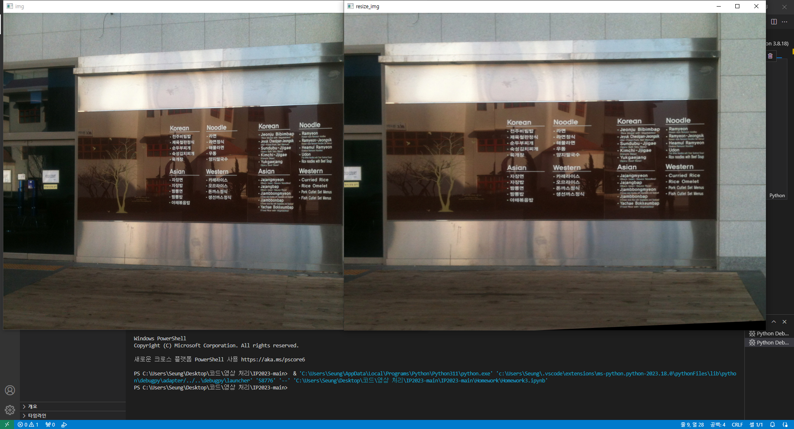
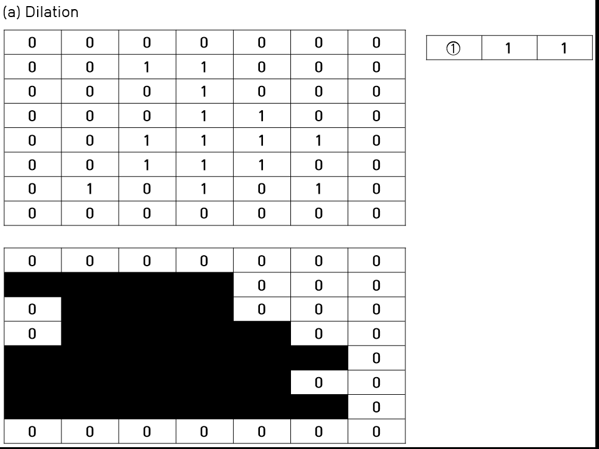
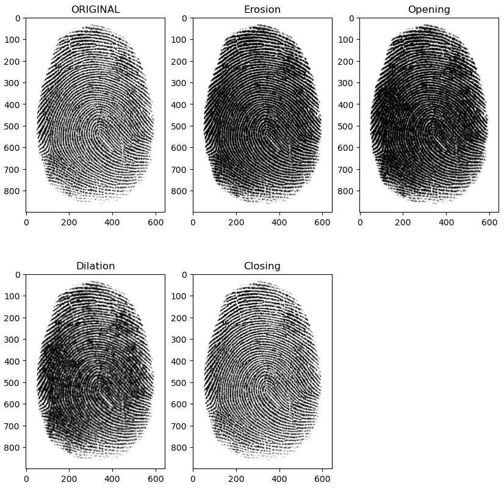

# Image Processing
OpenCV-Python Tutorials

Homework1
</img>

Homework2
</img>

Homework3
</img>

Homework-Morphological Operator

</img>
</img>

Homework-youtube
https://www.youtube.com/channel/UCoDzF7OKYkziMIfPunU7Oiw

